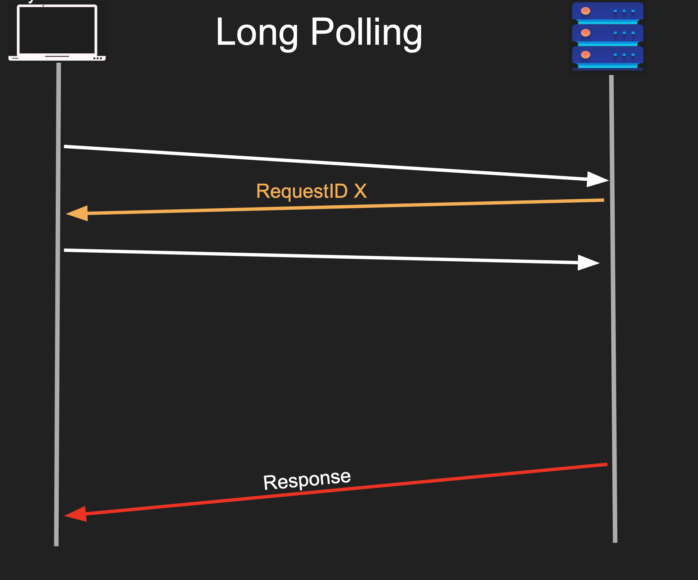

# Long Polling

`Long polling` is a web communication technique used to emulate real-time server pushes over standard HTTP

Instead of the server returning an immediate empty response when no data is available, it holds the client's request open until new data is ready to be sent

● Client sends a request
● Server responds immediately with a handle
● Server continues to process the request
● Client uses that handle to check for status
● Server DOES not reply until it has the response
● So we got a handle, we can disconnect and we are less chatty
● Some variation has timeouts too

 

## Pros

- Less chatty and backend friendly
- Client can still disconnect

## Cons

- Not real time
