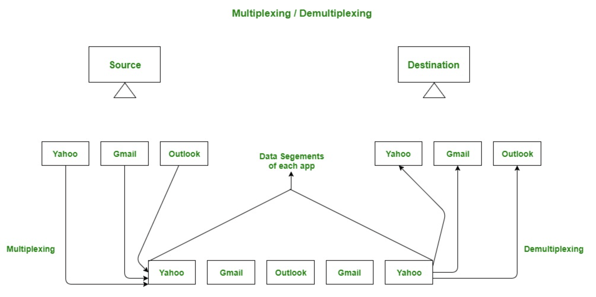
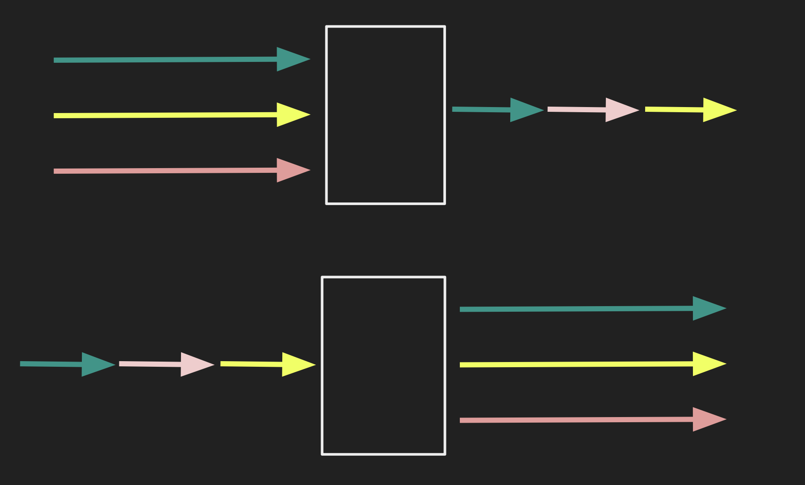
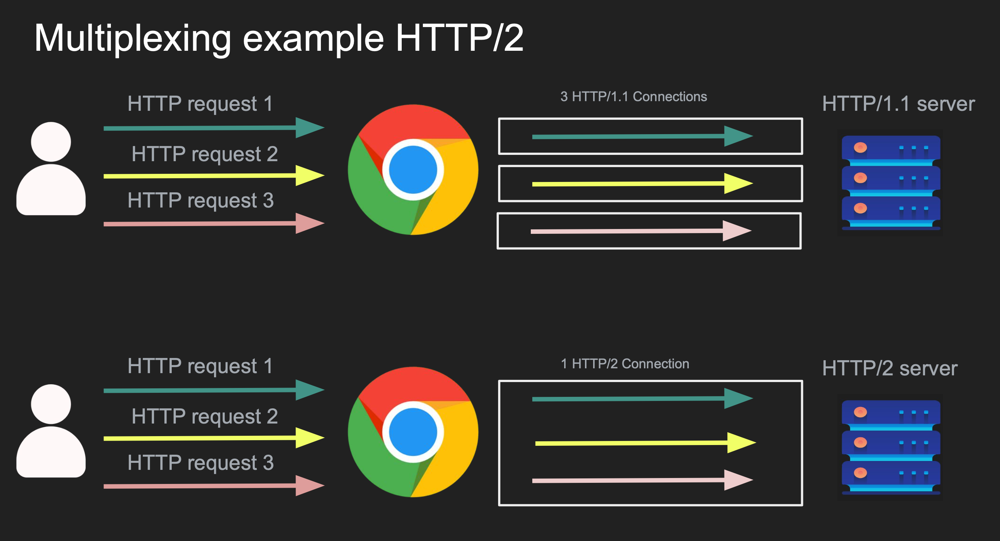
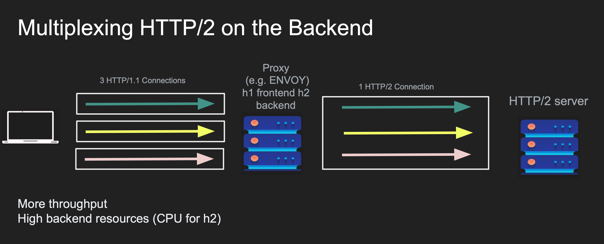
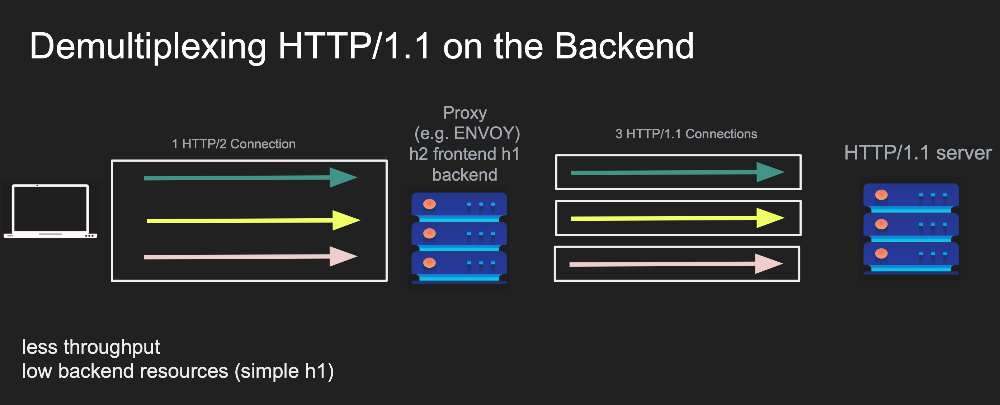
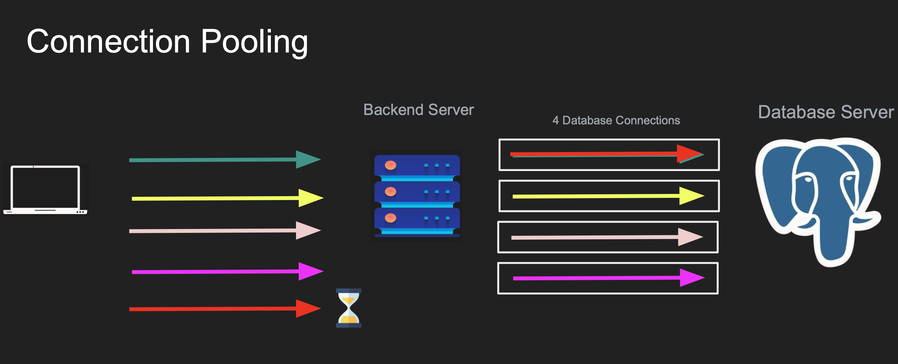
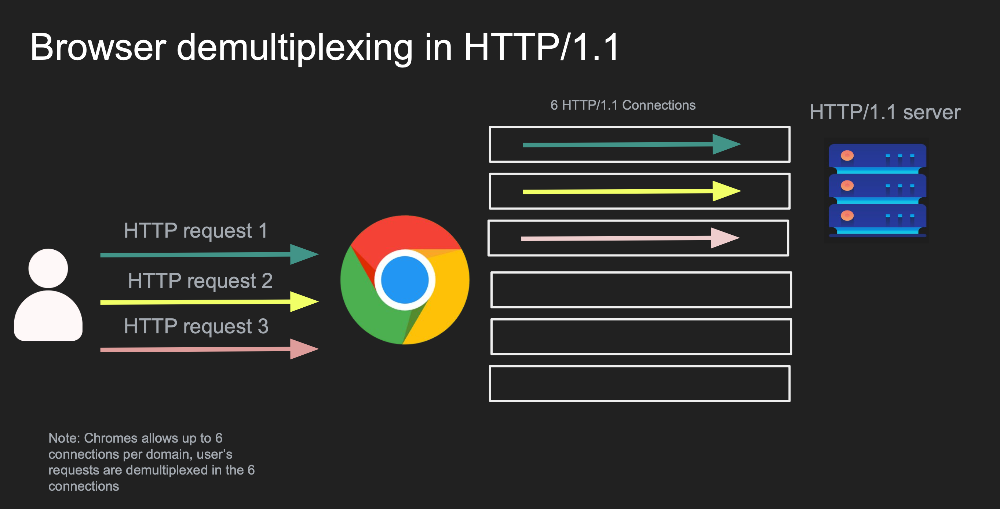

# Multiplexing and Demultiplexing

`Multiplexing` is gathering data from multiple application processes of the sender, enveloping that data with a header, and sending them as a whole to the intended receiver is called multiplexing.

`Demultiplexing` is delivering received segments at the receiver side to the correct app layer processes is called demultiplexing.

