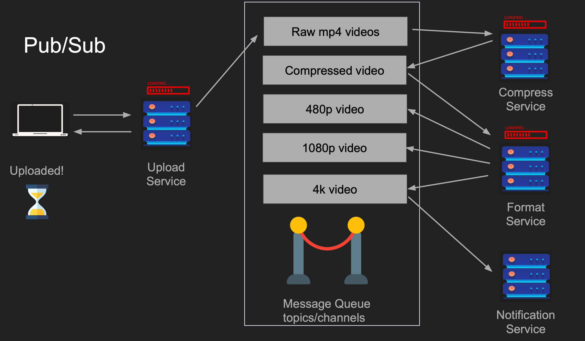

# Publish Subscribe Model

The `publish-subscribe (pub/sub) model` is a messaging pattern in software architecture where senders (publishers) and receivers (subscribers) communicate asynchronously through a central broker, without knowing each other's identities

 

## Core Components

`Publishers`: The services or applications that generate events or data and send them to the broker, categorized by specific topics.

`Subscribers`: The services or applications that express interest in specific topics and consume the incoming messages automatically.

`Topics/Channels`: The specific categories or feeds that publishers push data into and that subscribers listen to.

`Message Broker`: The central system (like an event bus) that receives messages from publishers and securely routes them to all interested subscribers.

 

## Pros

● Scales w/ multiple receivers
● Great for microservices
● Loose Coupling
● Works while clients not running

## Cons

● Message delivery issues (Two generals problem)
● Complexity
● Network saturation
