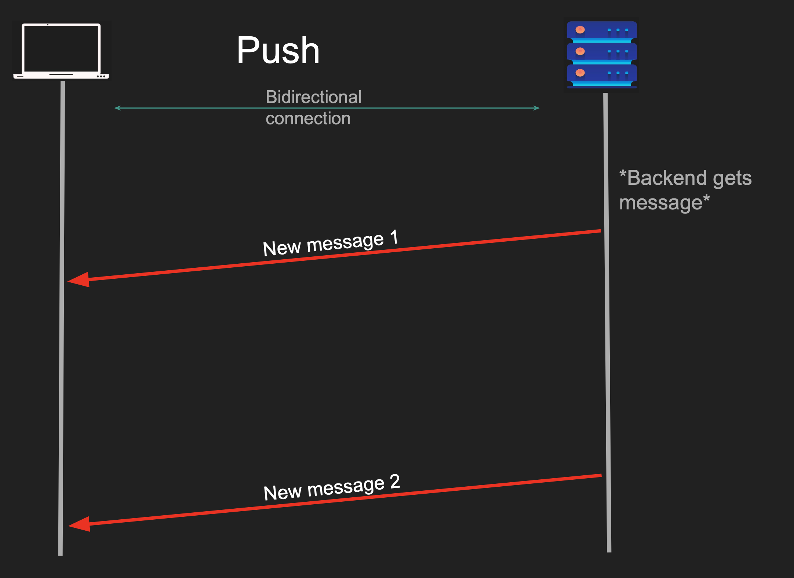

# Push Model

`Push Model` a communication model where the server actively sends (or "pushes") data to connected clients as soon as an event occurs, instead of waiting for the client to explicitly request or poll for it

Use for to do as soon as possible

- Client connects to a server
- Server sends data to the client
- Client doesn’t have to request anything
- Protocol must be bidirectional

This is exactly similar to Websockets

Websockets are created using on top of push model
