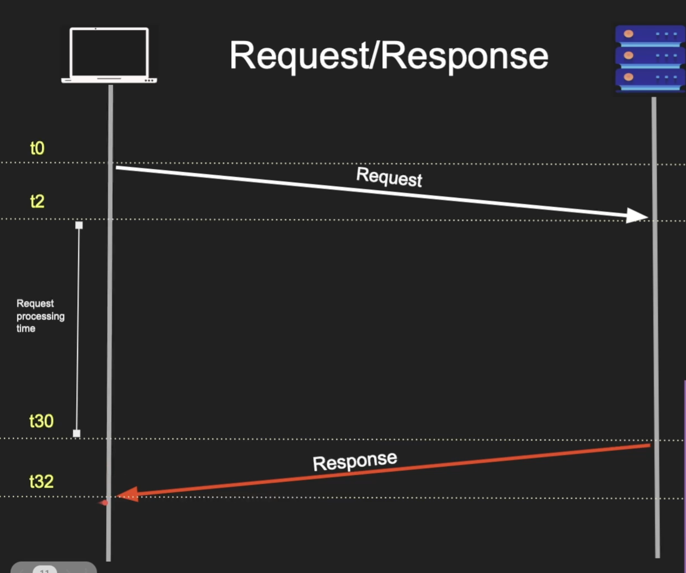

# Request Response Model

`Client-Server Architecture` is a foundational computing model where tasks are distributed between service requesters (clients) and service providers (servers)

<br/>


<br/>

- Client send the request
- Server parses the request
- Server process the request
- Server send the response
- Client parse the response and consume

## Where used

- Web / HTTTP / DNS / SSH
- Remote Procedure Call (RPC)
- SQL and Database Protocols
- APIs (REST / SOAP / GraphQL)

<br/>

## Anatomy of Request / Response



- Anatomy was request was defined by both `Client` and `Server`
- Request has a boundary
- Defined by a protocol and message format (`XML` / `JSON`)

---

The thing is Client Server Architecture doesn't work always

- Notificaiton Services (Polling Machanism)
- Chatting Services (Websockets Machanism)
- Very Long Requests
- What if Client / Server disconnects

<br/>

## Demo

```bash
curl http://google.com -v --trace html.txt
```

It will give you something like this. We can identify how client server actually works

```
== Info: Host google.com:80 was resolved.
== Info: IPv6: 2404:6800:4000:101d::8b, 2404:6800:4000:101d::71, 2404:6800:4000:101d::65, 2404:6800:4000:101d::8a
== Info: IPv4: 192.178.173.102, 192.178.173.100, 192.178.173.138, 192.178.173.101, 192.178.173.139, 192.178.173.113
== Info:   Trying [2404:6800:4000:101d::8b]:80...
== Info: Connected to google.com (2404:6800:4000:101d::8b) port 80
=> Send header, 73 bytes (0x49)
0000: 47 45 54 20 2f 20 48 54 54 50 2f 31 2e 31 0d 0a GET / HTTP/1.1..
0010: 48 6f 73 74 3a 20 67 6f 6f 67 6c 65 2e 63 6f 6d Host: google.com
0020: 0d 0a 55 73 65 72 2d 41 67 65 6e 74 3a 20 63 75 ..User-Agent: cu
0030: 72 6c 2f 38 2e 37 2e 31 0d 0a 41 63 63 65 70 74 rl/8.7.1..Accept
0040: 3a 20 2a 2f 2a 0d 0a 0d 0a                      : */*....
== Info: Request completely sent off
<= Recv header, 32 bytes (0x20)
0000: 48 54 54 50 2f 31 2e 31 20 33 30 31 20 4d 6f 76 HTTP/1.1 301 Mov
0010: 65 64 20 50 65 72 6d 61 6e 65 6e 74 6c 79 0d 0a ed Permanently..
<= Recv header, 34 bytes (0x22)
0000: 4c 6f 63 61 74 69 6f 6e 3a 20 68 74 74 70 3a 2f Location: http:/
0010: 2f 77 77 77 2e 67 6f 6f 67 6c 65 2e 63 6f 6d 2f /www.google.com/
0020: 0d 0a                                           ..
<= Recv header, 40 bytes (0x28)
0000: 43 6f 6e 74 65 6e 74 2d 54 79 70 65 3a 20 74 65 Content-Type: te
0010: 78 74 2f 68 74 6d 6c 3b 20 63 68 61 72 73 65 74 xt/html; charset
0020: 3d 55 54 46 2d 38 0d 0a                         =UTF-8..
<= Recv header, 245 bytes (0xf5)
0000: 43 6f 6e 74 65 6e 74 2d 53 65 63 75 72 69 74 79 Content-Security
0010: 2d 50 6f 6c 69 63 79 2d 52 65 70 6f 72 74 2d 4f -Policy-Report-O
0020: 6e 6c 79 3a 20 6f 62 6a 65 63 74 2d 73 72 63 20 nly: object-src 
0030: 27 6e 6f 6e 65 27 3b 62 61 73 65 2d 75 72 69 20 'none';base-uri 
0040: 27 73 65 6c 66 27 3b 73 63 72 69 70 74 2d 73 72 'self';script-sr
0050: 63 20 27 6e 6f 6e 63 65 2d 4f 66 53 51 7a 73 61 c 'nonce-OfSQzsa
0060: 4e 6a 49 49 59 57 35 64 33 65 72 55 33 4a 51 27 NjIIYW5d3erU3JQ'
0070: 20 27 73 74 72 69 63 74 2d 64 79 6e 61 6d 69 63  'strict-dynamic
0080: 27 20 27 72 65 70 6f 72 74 2d 73 61 6d 70 6c 65 ' 'report-sample
0090: 27 20 27 75 6e 73 61 66 65 2d 65 76 61 6c 27 20 ' 'unsafe-eval' 
00a0: 27 75 6e 73 61 66 65 2d 69 6e 6c 69 6e 65 27 20 'unsafe-inline' 
00b0: 68 74 74 70 73 3a 20 68 74 74 70 3a 3b 72 65 70 https: http:;rep
00c0: 6f 72 74 2d 75 72 69 20 68 74 74 70 73 3a 2f 2f ort-uri https://
00d0: 63 73 70 2e 77 69 74 68 67 6f 6f 67 6c 65 2e 63 csp.withgoogle.c
00e0: 6f 6d 2f 63 73 70 2f 67 77 73 2f 6f 74 68 65 72 om/csp/gws/other
00f0: 2d 68 70 0d 0a                                  -hp..
<= Recv header, 37 bytes (0x25)
0000: 44 61 74 65 3a 20 4d 6f 6e 2c 20 32 32 20 4a 75 Date: Mon, 22 Ju
0010: 6e 20 32 30 32 36 20 31 31 3a 33 38 3a 34 33 20 n 2026 11:38:43 
0020: 47 4d 54 0d 0a                                  GMT..
<= Recv header, 40 bytes (0x28)
0000: 45 78 70 69 72 65 73 3a 20 57 65 64 2c 20 32 32 Expires: Wed, 22
0010: 20 4a 75 6c 20 32 30 32 36 20 31 31 3a 33 38 3a  Jul 2026 11:38:
0020: 34 33 20 47 4d 54 0d 0a                         43 GMT..
<= Recv header, 40 bytes (0x28)
0000: 43 61 63 68 65 2d 43 6f 6e 74 72 6f 6c 3a 20 70 Cache-Control: p
0010: 75 62 6c 69 63 2c 20 6d 61 78 2d 61 67 65 3d 32 ublic, max-age=2
0020: 35 39 32 30 30 30 0d 0a                         592000..
<= Recv header, 13 bytes (0xd)
0000: 53 65 72 76 65 72 3a 20 67 77 73 0d 0a          Server: gws..
<= Recv header, 21 bytes (0x15)
0000: 43 6f 6e 74 65 6e 74 2d 4c 65 6e 67 74 68 3a 20 Content-Length: 
0010: 32 31 39 0d 0a                                  219..
<= Recv header, 21 bytes (0x15)
0000: 58 2d 58 53 53 2d 50 72 6f 74 65 63 74 69 6f 6e X-XSS-Protection
0010: 3a 20 30 0d 0a                                  : 0..
<= Recv header, 29 bytes (0x1d)
0000: 58 2d 46 72 61 6d 65 2d 4f 70 74 69 6f 6e 73 3a X-Frame-Options:
0010: 20 53 41 4d 45 4f 52 49 47 49 4e 0d 0a           SAMEORIGIN..
<= Recv header, 2 bytes (0x2)
0000: 0d 0a                                           ..
<= Recv data, 219 bytes (0xdb)
0000: 3c 48 54 4d 4c 3e 3c 48 45 41 44 3e 3c 6d 65 74 <HTML><HEAD><met
0010: 61 20 68 74 74 70 2d 65 71 75 69 76 3d 22 63 6f a http-equiv="co
0020: 6e 74 65 6e 74 2d 74 79 70 65 22 20 63 6f 6e 74 ntent-type" cont
0030: 65 6e 74 3d 22 74 65 78 74 2f 68 74 6d 6c 3b 63 ent="text/html;c
0040: 68 61 72 73 65 74 3d 75 74 66 2d 38 22 3e 0a 3c harset=utf-8">.<
0050: 54 49 54 4c 45 3e 33 30 31 20 4d 6f 76 65 64 3c TITLE>301 Moved<
0060: 2f 54 49 54 4c 45 3e 3c 2f 48 45 41 44 3e 3c 42 /TITLE></HEAD><B
0070: 4f 44 59 3e 0a 3c 48 31 3e 33 30 31 20 4d 6f 76 ODY>.<H1>301 Mov
0080: 65 64 3c 2f 48 31 3e 0a 54 68 65 20 64 6f 63 75 ed</H1>.The docu
0090: 6d 65 6e 74 20 68 61 73 20 6d 6f 76 65 64 0a 3c ment has moved.<
00a0: 41 20 48 52 45 46 3d 22 68 74 74 70 3a 2f 2f 77 A HREF="http://w
00b0: 77 77 2e 67 6f 6f 67 6c 65 2e 63 6f 6d 2f 22 3e ww.google.com/">
00c0: 68 65 72 65 3c 2f 41 3e 2e 0d 0a 3c 2f 42 4f 44 here</A>...</BOD
00d0: 59 3e 3c 2f 48 54 4d 4c 3e 0d 0a                Y></HTML>..
== Info: Connection #0 to host google.com left intact
```
