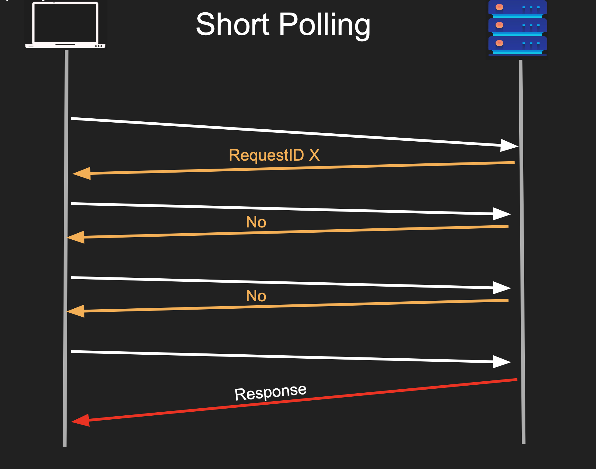

# Short Polling

`Short Polling` is the client repeatedly sends short periodic HTTP requests at fixed time intervals (e.g., every 5 seconds) to check for updates

## How it Works

● Client sends a request
● Server responds immediately with a handle
● Server continues to process the request
● Client uses that handle to check for status
● Multiple “short” request response as polls

 

## Pros

- Simple
- Good for long running requests
- Client can disconnect

## Cons

- Too chatty
- Network bandwidth
- Wasted Backend resources
