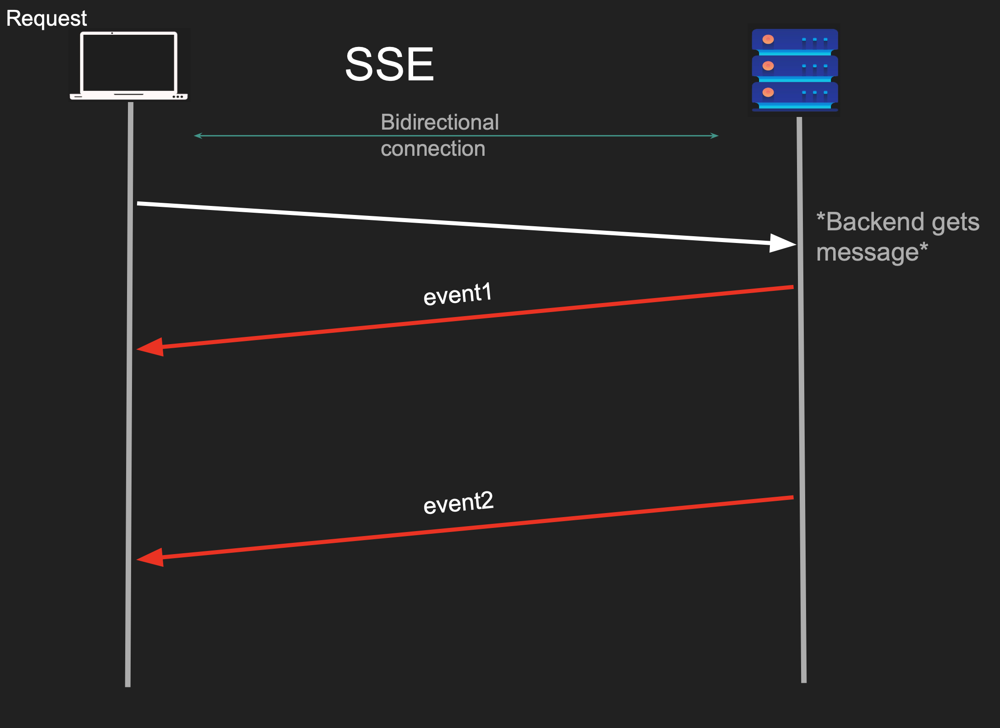

# Server Sent Events

`Server-Sent Events (SSE)` is a web technology that allows a server to push continuous, real-time updates to a web browser or client over a single, long-lived HTTP connection

Unlike WebSockets, it is strictly unidirectional—data only flows from the server to the client

```
One Request, a very very long responses from server
```



● A response has start and end
● Client sends a request
● Server sends logical events as part of response
● Server never writes the end of the response
● It is still a request but an unending response
● Client parses the streams data looking for events
● Works with request/response (HTTP)

<br/>

## How SSE Works

`The Request`: The client initiates a standard HTTP request to the server, establishing a connection.

`The Stream`: The server sets its content type to text/event-stream and keeps the connection open.

`The Push`: Whenever new data is available, the server actively pushes it down the already-open pipeline instead of closing the connection.

`The Handling`: The client's browser captures these events via the built-in JavaScript EventSource API.

<br/>

## Pros

- Real time
- Compatible with Request/response

## Cons

- Clients must be online
- Clients might not be able to handle
- Polling is preferred for light clients
- HTTP/1.1 problem (6 connections)
